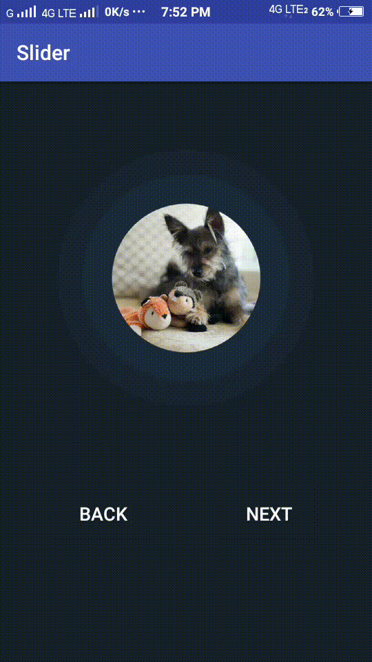

# Image-Slider-View [](https://jitpack.io/#AjaySharvesh3/Image-Slider-View)

## Description

Slider Library is simple for creating beatiful UI for image sliding in circular view.
Sliding them in both left and right with the help of buttons, texts etc.
Easy to implement on your device.

## Demo Gif



## How to implement it?

#### 1. First, add the JitPack repository to your `build.gradle` file (project level)

```
allprojects {
		repositories {
			...
			maven { url 'https://jitpack.io' }
		}
	} 
  ```
  #### 2. Second, add Module dependency in your `app/build.gradle` file
  
  ```
  dependencies {
	        implementation 'com.github.AjaySharvesh3:Image-Slider-View:v1.0'
	}
  ```
  #### 3. Third, add this XML code to your activity (Any of your activity you need to implement it on)
  
  ```xml
   <com.wolfpack.ajays.slider.Slider
       android:id="@+id/slider"
       android:layout_width="wrap_content"
       android:layout_height="wrap_content"
       android:layout_marginTop="50dp"
       android:layout_centerHorizontal="true"/>
```
#### 4. Fourth step, add some image resources in Java

```java
        slider = findViewById(R.id.slider);
        int [] id = new int [] {R.drawable.dogone, R.drawable.dogtwo,  R.drawable.dogthree};
        slider.setImageResource(id);
```        
#### 5. Now you need to command this view when you want to slide to next item. So you can call helper method like:

```
//Slide image in left
slider.slideLeft();

//Slide image in right
slider.slideRight();
```
### Additional Works

#### 1. You can also listen to events when the slider reaches its end.
Just call `.setSlideListener` method and pass the implementation `slider.SlideListener` interface.

```
            slider.setSlideListener(new Slider.SlideListener() {
            @Override
            public void onReachedFirst() {
                Toast.makeText(MainActivity.this,"Reached 1st Position!",Toast.LENGTH_LONG).show();
            }

            @Override
            public void onReachedLast() {
                Toast.makeText(MainActivity.this,"Reached last Position!", Toast.LENGTH_LONG).show();
            }

        });
```

#### 2. You can also customize your color for Concentric circles by:

```java
    slider.setColor(Color.parseColor("#009988"));
```

### Contributions

Any contributions are welcome. You can send PR or open issues.
